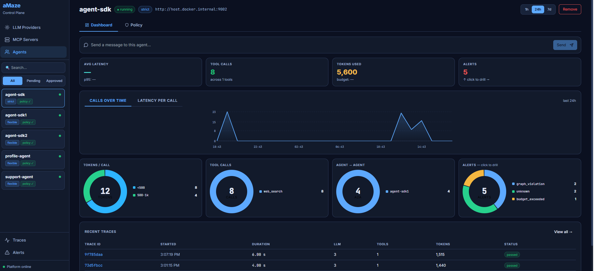
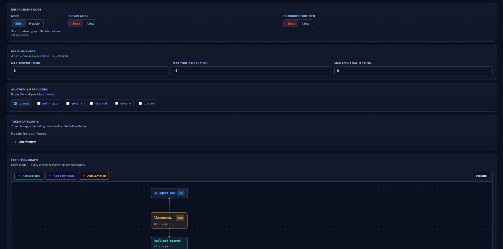
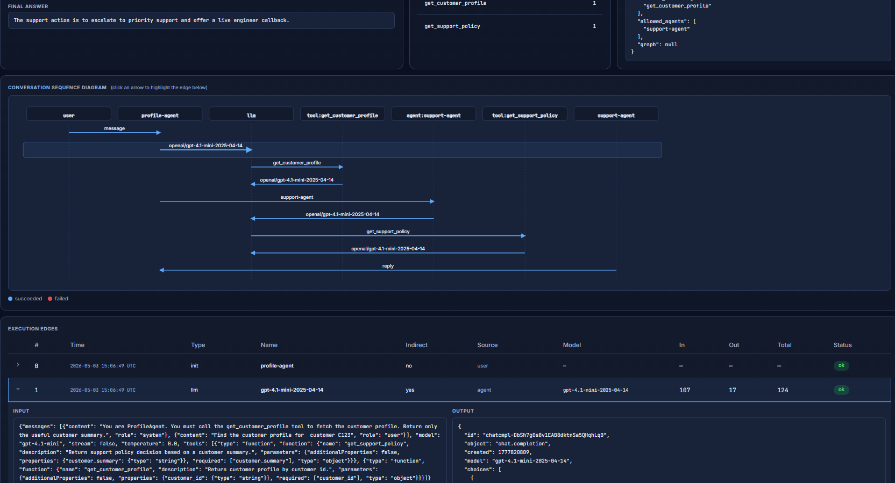
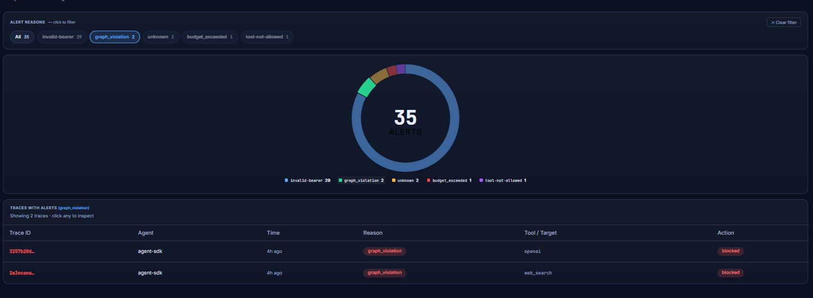

<div align="center">

# aMaze Control Plane

### Proxy-first runtime governance, observability, and execution control for AI agents.

[](LICENSE)
[](https://python.org)
[](docker/docker-compose.yml)
[](https://redis.io)

</div>

---

aMaze Control Plane lets teams run AI agents, MCP tools, and agent-to-agent workflows through a controlled runtime layer where every LLM call, tool call, MCP request, and remote-agent interaction can be observed, audited, limited, or blocked — without touching agent code.

---

## Why aMaze exists

Modern agent frameworks make it easy to build agents, but hard to control them once they start acting autonomously.

Common problems:

- Agents call tools you did not expect.
- LLM cost grows through hidden loops and retries.
- MCP servers run on different hosts with weak runtime visibility.
- Agent-to-agent calls bypass central security logic.
- Traces show what happened, but not always why it was allowed.

**aMaze adds a control plane around the agent runtime.** Instead of trusting every framework, tool, and prompt, aMaze routes agent traffic through a proxy and orchestrator that enforce policies at runtime.

---

## What aMaze does

### Runtime control

- Enforce allowed tools, agents, and LLM providers per agent.
- Cap token spend per turn, per time window, and across providers.
- Block unauthorized LLM, MCP, or agent-to-agent calls before they reach the upstream.
- Apply execution graph policies — strict call ordering or flexible allowed sets — with per-step loop limits.

### Proxy-first enforcement

All agent traffic goes through the aMaze proxy. No agent code changes required.

```
Agent  ──►  aMaze Proxy  ──►  LLM Provider   (openai, anthropic, …)
                         ──►  MCP Tool Server
                         ──►  Peer Agent      (A2A)
```

Policy enforcement runs in-process inside the proxy. If any check fails, the request is denied. There is no fail-open mode.

### Remote agent and MCP registration

Agents and MCP servers can run in separate containers or on different hosts. They register with the orchestrator through a known endpoint. After registration, the orchestrator knows the agent's identity, allowed tools, policy bindings, runtime limits, and network location.

### What you get

| Capability | What it does |
|---|---|
| **A2A enforcement** | Control which agents can call which peers |
| **MCP tool enforcement** | Allow/deny specific tools per MCP server |
| **LLM enforcement** | Allowlist providers, models, and token budgets |
| **Execution graph** | Enforce tool/agent call ordering — strict or flexible mode |
| **Per-turn limits** | `max_tokens`, `max_tool_calls`, `max_agent_calls` reset each message |
| **Time-window rate limits** | Token budgets per 10 min / 1 hr via RedisTimeSeries |
| **Immutable audit log** | Redis Streams — every call, allowed or denied, with full I/O |
| **Distributed traces** | OTel spans → Jaeger, each conversation shares one `trace_id` |
| **Live policy editing** | GUI policy editor — changes take effect immediately, no restart |
| **GUI dashboard** | Inspect traces, drill into alerts, manage policies |
| **Zero framework coupling** | Works with LangChain, CrewAI, raw httpx — anything that respects `HTTP_PROXY` |

### What makes aMaze different

| Area | Typical approach | aMaze |
|---|---|---|
| Enforcement location | Inside agent code | Proxy + policy engine — no agent changes |
| Framework dependency | Often framework-specific | Works with anything that respects `HTTP_PROXY` |
| MCP visibility | Usually partial | Every MCP call routed and governed |
| Remote agents | Often unmanaged | Registered, identified, and policy-bound |
| Audit | Logs and traces | Decision evidence + traces + policy context |

---

## Screenshots

**Agent dashboard** — live KPIs, calls-over-time chart, and four interactive donuts (tokens/call, tool calls, A2A hops, alert reasons). Click any donut slice to drill into filtered traces.



**Execution graph editor** — drag-to-connect canvas for strict-mode policies. Each node shows call type, step number, and loop limit. Validate before save.



**Trace detail** — per-conversation sequence diagram with swim lanes for every participant. Click an arrow to highlight the corresponding edge row. Full input/output in the table below.



**Alerts** — policy violations and budget breaches grouped by reason. Click a donut slice or reason pill to filter the traces table. Click any row to open the trace detail.



---

## How it works

The proxy intercepts every outbound request from every agent and runs the enforcement chain in-process:

```
session_id      →  bearer token → agent identity (spoof-proof)
policy_enforcer →  A2A / MCP / LLM allowlist checks
graph_enforcer  →  step ordering, loop limits
stream_blocker  →  inject "stream":false for complete audit records
tracer          →  open/close OTel spans
router          →  resolve host → upstream URL from Redis
counters        →  RedisTimeSeries metrics
audit_log       →  XADD to Redis Stream
```

---

## Quick start

**Prerequisites:** Docker + Docker Compose.

```bash
# 1. Start the control plane
docker compose -f docker/docker-compose.yml up -d

# 2. Wire aMaze into your agent
```

```python
import amaze

# Define one or both handlers — aMaze calls these on incoming messages.
async def receive_message_from_user(message):
    result = await my_agent.ainvoke({"messages": [{"role": "user", "content": message}]})
    return result["messages"][-1].content

async def receive_message_from_agent(caller, message):
    return await receive_message_from_user(message)

if __name__ == "__main__":
    amaze.init()   # reads AMAZE_AGENT_ID from env, registers, starts servers
```

```yaml
# 3. Add your agent as a service in a compose file
services:
  my-agent:
    build: .
    environment:
      AMAZE_AGENT_ID: my-agent
      AMAZE_ORCHESTRATOR_URL: http://host.docker.internal:8001
      HTTP_PROXY: http://host.docker.internal:8080
      HTTPS_PROXY: http://host.docker.internal:8080
    extra_hosts:
      - "host.docker.internal:host-gateway"
```

```bash
docker compose \
  -f docker/docker-compose.yml \
  -f docker-compose.agents.yml \
  up --build
```

Your agent is now under full policy enforcement. See `examples/compose.yml` for a complete multi-agent reference.

- Jaeger traces → [http://localhost:16686](http://localhost:16686)
- Control plane GUI → [http://localhost:5173](http://localhost:5173)

---

## Policy model

One policy per agent. Stored in  Redis (runtime). The GUI and `PUT /policy/{id}` API write to Redis directly — changes are live on the next request.

```yaml
name: my-agent-policy

# Per-turn limits — reset at the start of each user message
max_tokens_per_turn: 10000
max_tool_calls_per_turn: 20
max_agent_calls_per_turn: 5
allowed_llm_providers: [openai, anthropic]

# Time-window token budgets (RedisTimeSeries pre-check)
token_rate_limits:
  - window: 10m
    max_tokens: 2000
  - window: 1h
    max_tokens: 10000

# Violation behaviour — alert always written; this controls blocking only
on_budget_exceeded: block   # block | allow
on_violation: block         # block | allow

# flexible: allowed tool/agent set, any order
mode: flexible
allowed_tools: [web_search, summarize]
allowed_agents: [summarizer-agent]

# strict: exact call order enforced
# mode: strict
# graph:
#   start_step: 1
#   steps:
#     - step_id: 1
#       call_type: tool
#       callee_id: web_search
#       max_loops: 3
#       next_steps: [2]
#     - step_id: 2
#       call_type: agent
#       callee_id: summarizer-agent
#       max_loops: 1
#       next_steps: []
```

---

## Observability

Every proxied call produces three correlated records:

**Audit log** (`audit:{agent_id}` Redis Stream):
```
trace_id  span_id  agent_id  session_id
kind      target   tool
input     output   ts
denied    denial_reason
```

**OTel span** (Jaeger all-in-one, bundled in the platform container):
- All calls in one conversation share a single `trace_id`
- A2A hops propagate trace context automatically
- Linked to audit records via `trace_id` + `span_id`

**Metrics** (RedisTimeSeries):
```
ts:{agent_id}:llm_tokens
ts:{agent_id}:tool_calls
ts:{agent_id}:a2a_calls
ts:{agent_id}:denials
```

---

## Failure handling

| Condition | Result |
|---|---|
| Unknown bearer token | `403 invalid-bearer` |
| Agent not in peer's allowlist | `403 not-allowed` |
| MCP server not registered | `403 mcp-not-allowed` |
| Tool not in policy | `403 tool-not-allowed` |
| LLM provider/model denied | `403 llm-not-allowed` |
| Graph step out of order | `403 graph_violation` |
| Loop limit exceeded | `429 edge_loop_exceeded` |
| Token budget exceeded | `403 budget_exceeded` |
| Rate limit exceeded | `403 rate-limit-exceeded` |
| Redis unavailable | `503` (fail closed) |
| Any addon raises | deny (fail closed) |

---

## Architecture

| Process | Container | Port | Role |
|---|---|---|---|
| redis-stack | `amaze-redis` | 6379 | State, counters, streams, timeseries |
| orchestrator | `amaze-platform` | 8001 | Session lifecycle, policy CRUD, audit API |
| proxy | `amaze-platform` | 8080 | mitmproxy + enforcement addon chain |
| jaeger | `amaze-platform` | 16686 / 4317 | OTel trace storage + UI |
| ui | `amaze-ui` | 5173 | React control dashboard |

Remote agents (different host, no shared Docker network) work by setting `HTTP_PROXY` to the platform's public IP. No Docker networking required.

---

## Repository layout

```
sdk/amaze/               Python SDK (bearer injection, self-registration)
services/proxy/          mitmproxy addons (the enforcement chain)
services/orchestrator/   FastAPI API (sessions, policies, audit queries)
services/ui/             React 19 + Vite + Tailwind dashboard
config/                  policies.yaml + mcp_servers.yaml (bootstrap)
tests/                   Full-stack system tests (real Redis, real proxy, no mocks)
examples/                Demo agent compose + agent scripts
docker/                  Platform compose, Dockerfiles, supervisord config
scripts/                 amaze-mcp-register CLI for MCP server self-registration
```

---

## Contributing

Issues and pull requests are welcome.

System tests run the full stack — real Redis, real proxy, no mocked enforcement paths. Run them with:

```bash
docker compose -f tests/compose.test.yml up -d
AMAZE_ORCHESTRATOR=http://localhost:18001 pytest tests/ -v
```

---

## License

[Apache 2.0](LICENSE)
